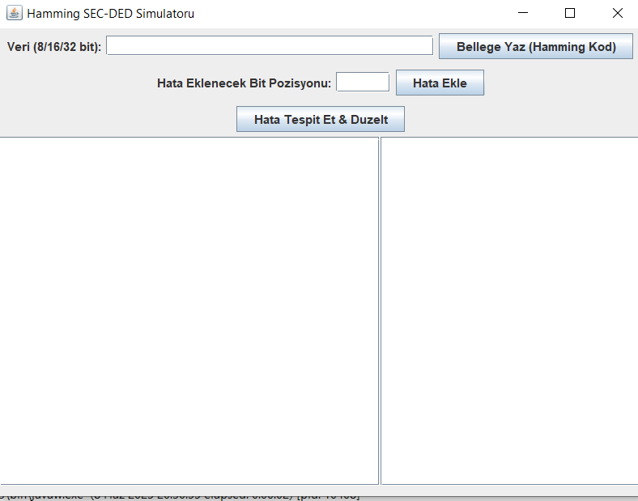
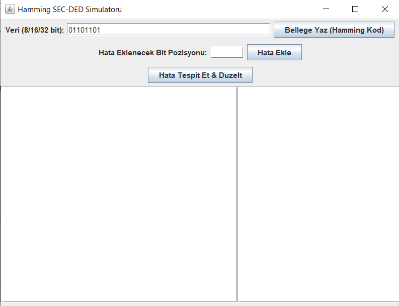
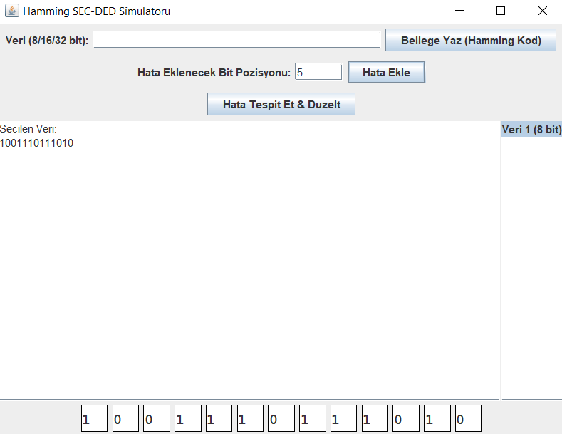
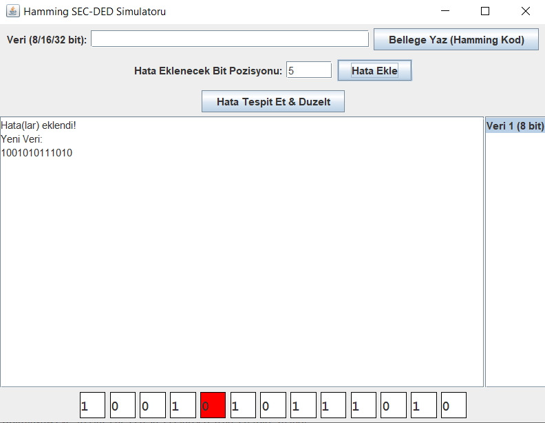
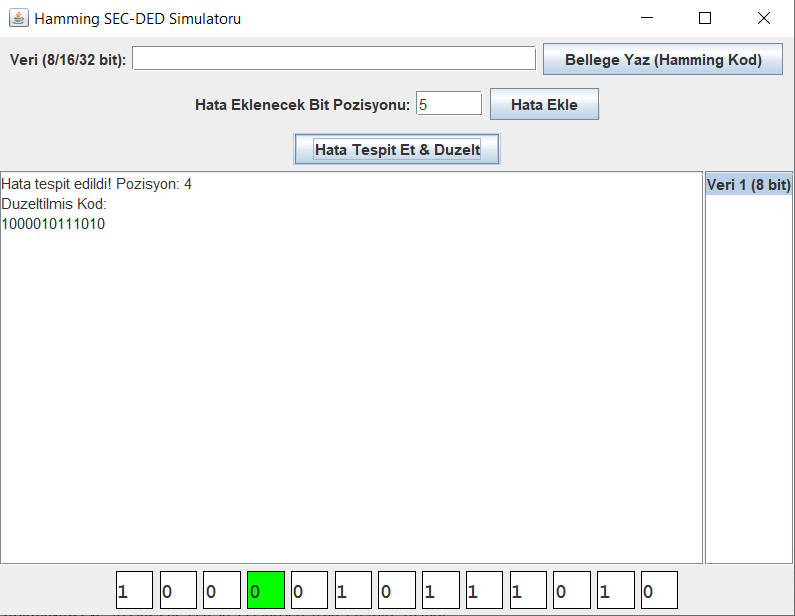
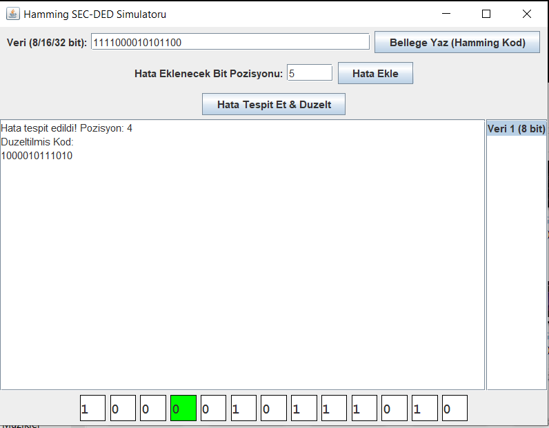
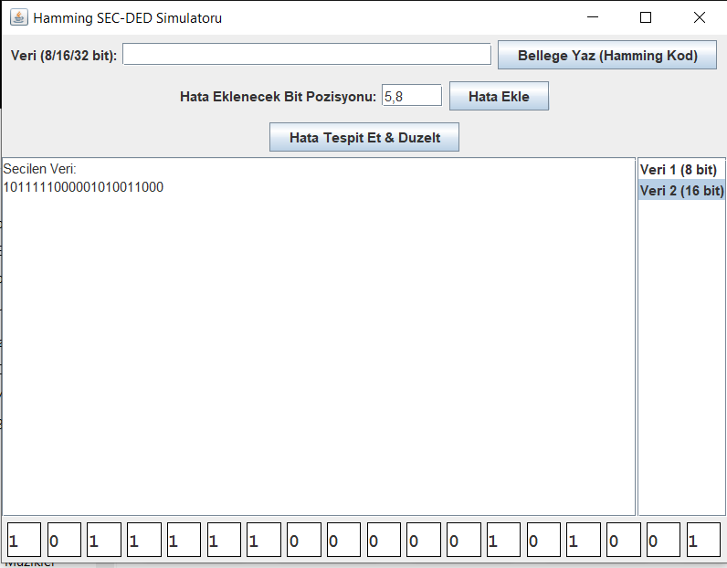
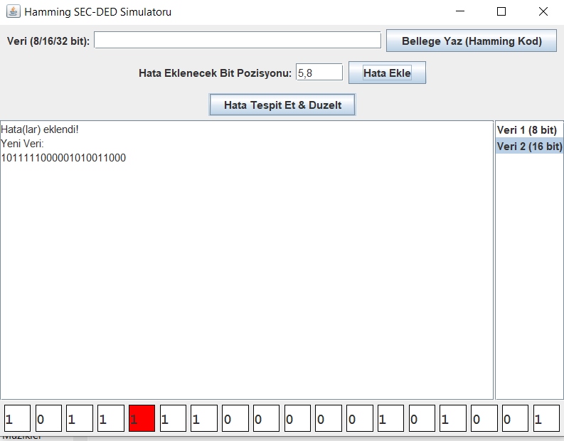
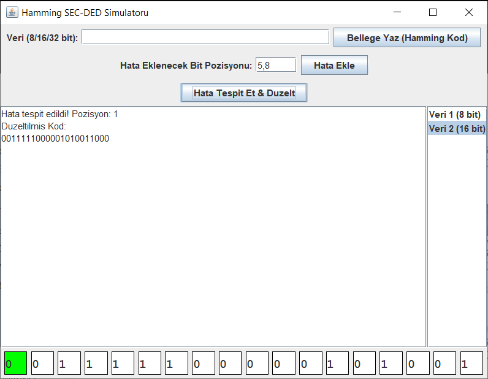

# SEC-DED Error Detector
Bu proje, Bursa Teknik Üniversitesi Bilgisayar Mimarisi BLM-0230 numaralı dersi kapsamınca hazırlanmıştır.

# Proje sahibi bilgileri
Ad:Yusuf
Soyad:Çil
Öğrenci Numarası:22360859012

## Proje Hakkında
Bu proje, bilgisayarda belleklerde saklanan verilerin zamanla ya da bir takım dış etmenlerle bozulması sonucu belleklerde bulunan bitlerde oluşabilecek tekli ya da çoklu hataları fark eden ve düzelten veya hatalı bit sayısı birden fazlaysa hatayı bulan ve hatalı duruma gelen veriden yola çıkarak Parity bitleri yardımıyla bütün veriyi değiştirerek tekrar kullanılabilir hale getiren bir programdır.

## Çalışma Mantığı
-Kullanıcı programı başlattıktan sonra açılan panele 8/16/32 bitlik veri girişi yapar.
-Hamming Code Algoritması ile girilen veri belleğe kaydedilir.
-Girilen numaralı bitlerde hata oluşturulur.
-Eğer hata sayısı birse sistem hatayı düzeltir, birden fazlaysa hataları kullanıcıya gösterir.

## Nasıl Çalıştırılır?
Projenin kaynak kodunu GitHub'dan indirdikten sonra Java yazılım dilinin çalıştırılabileceği bir IDE yardımıyla programı çalıştırarak deneyimleyebilirsiniz.

## Uygulama İçi Görseller
Veri giriş ekranı:

8 bitlik veri girişi:

8 bitlik veriye hata eklenmesi:

Hatanın düzeltilmesi:

16 bitlik veri girişi:

16 bitlik veriye hataların eklenmesi:

Hataların düzeltilmesi

## Proje Hakkındaki Youtube Videosu Linki
https://youtu.be/Caf_4nhR7mA

